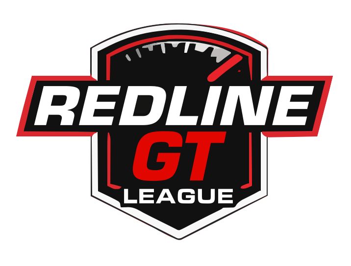

# 1. DISPOSIÇÕES GERAIS

  

REDLINE GT nasce para e pelo prazer do Gran turismo 7.

Mais que uma liga, somos um ponto de encontro onde pilotos e equipas se 
conectam através da competição saudável, tanto dentro como fora de pista.

Aqui não procuramos profissionais, somos apenas pessoas reais que querem viver 
a emoção das corridas virtuais e partilhar a sua paixão pelos motores.

Mais do que o cronômetro e da competitividade fria, na REDLINE, valorizamos a 
identidade de cada piloto e o espírito de sua equipa.

Em pista: Esperamos uma condução limpa e honesta. Os incidentes serão 
reportados pelos canais oficiais e serão tratados com educação.

Fora de pista: O respeito nos canais do Discord e grupos de voz é inegociável. 
Qualquer falta de respeito grave para com um companheiro ou organização, será 
motivo de revisão imediata por parte dos comissários.
