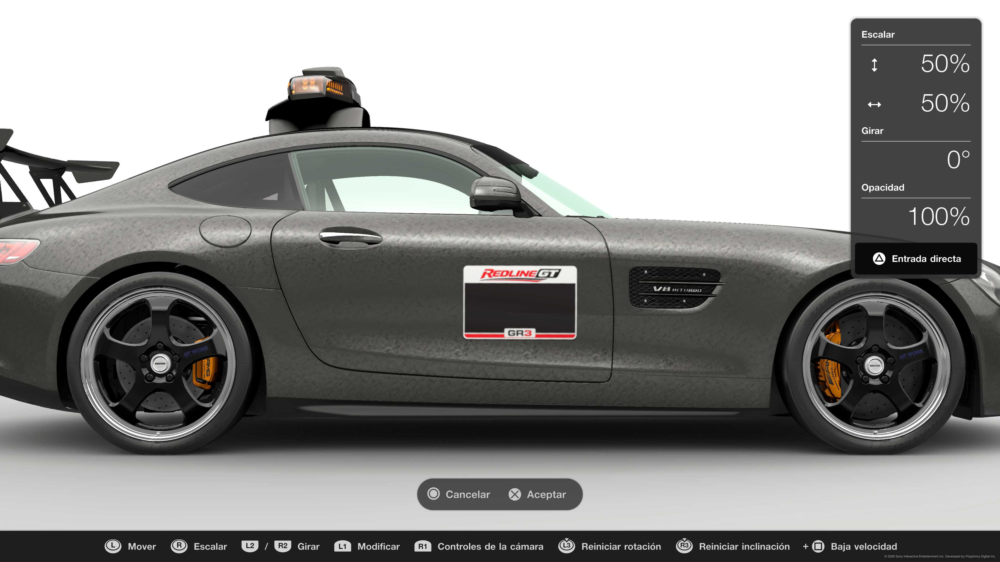

# 11. REQUISITOS DA PINTURA

Todos os carros que participem na REDLINE GT LEAGUE deverão
ter instalado nos seus designs o porta número oficial, em
ambos os lados do carro, em um tamanho mínimo de 50% por
50% (Ver Imagem)

## 11.1. Identificação obrigatória

  

As pinturas deverão permitir identificar claramente a
equipa e o piloto durante a corrida e transmissão.

Cada carro deverá incluir:

- A placa porta número oficial fornecida pela
  organização.

- O número do piloto visível em ambos os lados do carro.

- Um design semelhante entre os pilotos de uma mesma
  equipa.

## 11.2. Pintura da equipa

Recomenda-se que os pilotos da mesma equipa utilizem
designs semelhantes ou partilhem elementos visuais comuns
(cores, patrocinadores ou identidade gráfica) para
facilitar a identificação durante as transmissões.

Não serão permitidas pinturas que:

- Contenham menção a outras ligas ou competições externas
  sem autorização da organização.

- Contenham conteúdo ofensivo ou que possa ser
  desrespeitoso para outros pilotos ou membros da
  comunidade.

- Ocultar ou alterar a placa porta número oficial.